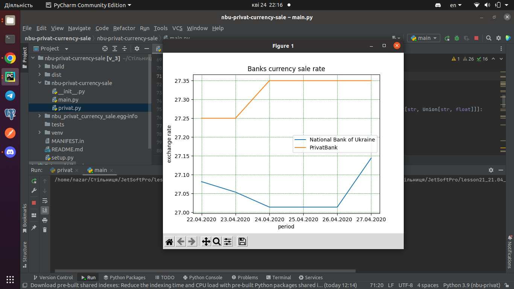

[](https://forthebadge.com)
[](https://forthebadge.com)


### nbu-privat-currency-sale: currency sale information getter from  National Bank of Ukraine and PrivatBank
***
What that library can do?

nbu-privat-currency-sale library allows you to get currency sale info from National Bank of Ukraine and PrivatBank. The information can be obtained by specifying a single date, or by specifying the date range. You can also download obtained information in json or csv formats and display a graph to compare currency sale rate of both banks.

---
How to install it?
```bash
pip install nbu_privat_currency_sale
```
---
Where to get it?

The source code is currently hosted on GitHub at: 
https://github.com/pandas-dev/pandas
---
What dependencies it uses?
- [Requests](https://pypi.org/project/requests/) for requests to banks API
- [Matplotlib](https://pypi.org/project/matplotlib/) to create the graphics

---

Brief examples:

1. Return sale rate information about all currency from National Bank of Ukraine:
```commandline
from datetime import datetime
from nbu_privat_currency_sale import get_nbu_currency_info

date1 = datetime(2020, 4, 22)
print(get_nbu_currency_info(date1)

# Output:
# [
#   {'bank': 'National Bank of Ukraine', 'date': '22.04.2020', 'currency': 'AUD', 'rate': 16.9936},
#   {'bank': 'National Bank of Ukraine', 'date': '22.04.2020', 'currency': 'CAD', 'rate': 19.0366},
#   ...
# ]
```
2. Return sale rate information about all currency  from PrivatBank:
```commandline
from datetime import datetime
from nbu_privat_currency_sale import get_privat_currency_info

date1 = datetime(2020, 4, 22)
get_privat_currency_info(date1)

# Output:
# [
#   {'bank': 'PrivatBank', 'date': '22.04.2020', 'currency': 'EUR', 'rate': 29.6},
#   {'bank': 'PrivatBank', 'date': '22.04.2020', 'currency': 'GBP', 'rate': 33.9},
#   ...
# ]
```
3. Return sale rate information about all currency from National Bank of Ukraine and from PrivatBank in certain date range
```commandline
from datetime import datetime
from nbu_privat_currency_sale import nbu_privat_currency_info_in_date_range

date1 = datetime(2020, 4, 22)
date2 = datetime(2020, 4, 23)
nbu_privat_currency_info_in_date_range(date1, date2)

# Output:
# [
#   {'bank': 'National Bank of Ukraine', 'date': '22.04.2020', 'currency': 'AUD', 'rate': 16.9936},
#   ...
#   {'bank': 'National Bank of Ukraine', 'date': '23.04.2020', 'currency': 'AUD', 'rate': 17.1046},
#   ...
#   {'bank': 'PrivatBank', 'date': '22.04.2020', 'currency': 'EUR', 'rate': 29.6},
#   ...
#   {'bank': 'PrivatBank', 'date': '23.04.2020', 'currency': 'EUR', 'rate': 29.5},
#   ...
# ]
```
4. Return sale rate information about currency from National Bank of Ukraine and from PrivatBank in certain date range filtered by 'currency' key value.
```commandline
from datetime import datetime
from nbu_privat_currency_sale import nbu_privat_currency_info_in_date_range, filter_by_currency_name

date1 = datetime(2020, 4, 22)
date2 = datetime(2020, 4, 23)

currency_info = nbu_privat_currency_info_in_date_range(date1, date2)
currency_value = 'USD'
filter_by_currency_name(currency_info, currency_value)

# Output:
# [
#   {'bank': 'National Bank of Ukraine', 'date': '22.04.2020', 'currency': 'USD', 'rate': 27.0815},
#   {'bank': 'PrivatBank', 'date': '22.04.2020', 'currency': 'USD', 'rate': 27.25},
#   {'bank': 'National Bank of Ukraine', 'date': '23.04.2020', 'currency': 'USD', 'rate': 27.0536},
#   {'bank': 'PrivatBank', 'date': '23.04.2020', 'currency': 'USD', 'rate': 27.25}
# ]
```
5. Return sale rate information about all currency from National Bank of Ukraine and from PrivatBank in certain date range filtered by 'currency' key value and grouped by 'bank'.
```commandline
from datetime import datetime
from nbu_privat_currency_sale import nbu_privat_currency_info_in_date_range, filter_by_currency_name, \
                                     group_by_bank_name

date1 = datetime(2020, 4, 22)
date2 = datetime(2020, 4, 23)

currency_info = nbu_privat_currency_info_in_date_range(date1, date2)
filtered_currency_info = filter_by_currency_name(currency_info, 'USD')
group_by_bank_name(filtered_currency_info)

# Output:
# [
#   [
#     {'bank': 'National Bank of Ukraine', 'date': '22.04.2020', 'currency': 'USD', 'rate': 27.0815},
#     {'bank': 'National Bank of Ukraine', 'date': '23.04.2020', 'currency': 'USD', 'rate': 27.0536}
#   ],
#   [
#     {'bank': 'PrivatBank', 'date': '22.04.2020', 'currency': 'USD', 'rate': 27.25},
#     {'bank': 'PrivatBank', 'date': '23.04.2020', 'currency': 'USD', 'rate': 27.25}
#   ]
# ]
```
---
